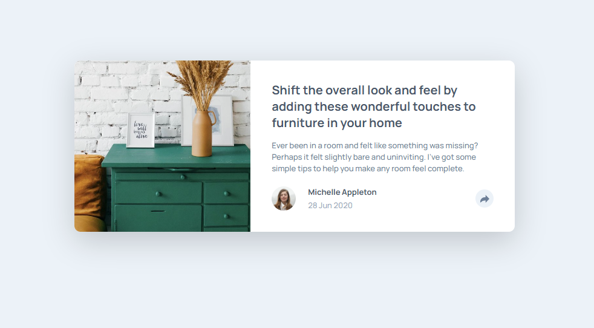

# Frontend Mentor - Article preview component solution

This is a solution to the [Article preview component challenge on Frontend Mentor](https://www.frontendmentor.io/challenges/article-preview-component-dYBN_pYFT). Frontend Mentor challenges help you improve your coding skills by building realistic projects. 

## Table of contents

- [Frontend Mentor - Article preview component solution](#frontend-mentor---article-preview-component-solution)
  - [Table of contents](#table-of-contents)
  - [Overview](#overview)
    - [The challenge](#the-challenge)
    - [Screenshot](#screenshot)
    - [Links](#links)
  - [My process](#my-process)
    - [Built with](#built-with)
    - [What I learned](#what-i-learned)
    - [Continued development](#continued-development)

**Note: Delete this note and update the table of contents based on what sections you keep.**

## Overview

### The challenge

Users should be able to:

- View the optimal layout for the component depending on their device's screen size
- See the social media share links when they click the share icon

### Screenshot




### Links

- Solution URL: [Frontend Mentor](https://www.frontendmentor.io/solutions/article-preview-component-solution-html-scss-and-js-4QHC_bzh--)
- Live Site URL: [GitHub Pages](https://sophie-mc-dev.github.io/article-preview-component/)

## My process

### Built with

- Semantic HTML5 markup
- CSS custom properties
- Flexbox
- CSS Grid


### What I learned

- Arrow box with CSS


```css
.pop-up:after {
  content: " ";
  position: absolute;
  right: 40%;
  bottom: -15px;
  border-color: $very-dark-grayish-blue;
  border-top: 15px solid $very-dark-grayish-blue;
  border-right: 15px solid transparent;
  border-left: 15px solid transparent;
  border-bottom: none;
}
```


If you want more help with writing markdown, we'd recommend checking out [The Markdown Guide](https://www.markdownguide.org/) to learn more.


### Continued development

- Mobile responsive design is still a bit of a struggle when the design differs a bit from the desktop one.
- CSS grid positioning.
